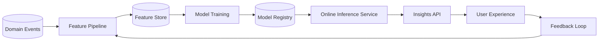

# AI, ML, Deep Learning, NLP, Neuroscience, and Data Science

## Current State
- Insight endpoints exist with a pluggable `InsightsClient` abstraction.
- Current default provider is deterministic and suitable for baseline behavior.

## Enterprise AI Architecture

## AI and Data Science Roadmap
- Supervised models for summary quality and intent classification.
- NLP for thematic extraction and reflective prompt generation.
- Ranking models for personalized question suggestions.
- Reinforcement-style feedback loops for suggestion utility.

## Deep Learning and NLP Opportunities
- Transformer-based text embeddings for semantic similarity.
- Sequence models for longitudinal trend prediction.
- Retrieval-augmented generation for grounded recommendations.

## Neuroscience-Inspired Design Notes
- Model temporal dynamics in reflective behavior (habit/streak effects).
- Include uncertainty estimates for suggestion confidence.
- Avoid overfitting to short-term emotional noise.

## Responsible AI Controls
- Model explainability for generated recommendations.
- Bias checks across language style and demographic proxies.
- Human override and fallback behavior for low-confidence outputs.
- Privacy controls for training and inference data usage.
