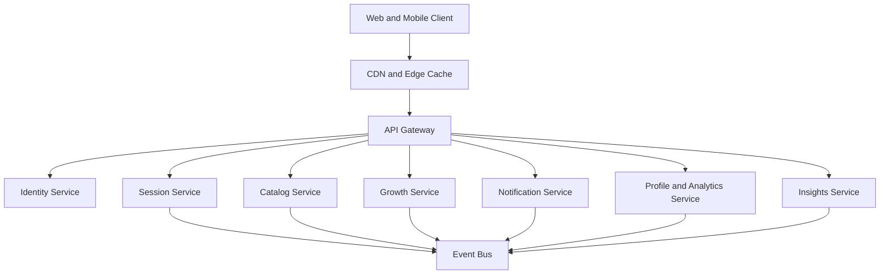

# Architecture

## Current Architecture
- Frontend: Angular SSR application.
- Backend: Spring Boot API with modular domain services.
- Persistence: PostgreSQL with Flyway migrations.
- Integration: SMTP for reset and reminder email.

## Target Enterprise Architecture

## Architectural Principles
- Clear bounded contexts with strict ownership.
- Database-per-context for independent evolution.
- Event-first integration for cross-context workflows.
- API contracts versioned and backward compatible.
- Observability as default: logs, metrics, traces, and SLO alerts.

## Reliability and Availability
- Active health checks and readiness gates.
- Graceful degradation for non-critical dependencies.
- Retry policies for transient external failures.
- Backup and restore strategy validated in drills.

## Security Model
- JWT-based authentication and role-based authorization.
- Rate limiting and abuse detection at edge and API layers.
- Defense-in-depth controls for API and data-plane traffic.
