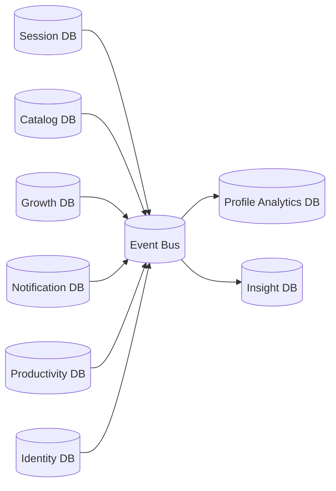

# Database Strategy and Design

## Current State
- One PostgreSQL database supports all bounded contexts in a modular monolith.
- Flyway migrations manage schema evolution.

## Target State: Database Per Context
Each major element owns an independent data store to allow autonomous scaling, deployment, and schema evolution.

## Context-to-Database Mapping
- Identity DB: users, credentials, reset tokens.
- Session DB: sessions, answers, daily aggregates.
- Catalog DB: categories, default prompts, custom prompts.
- Productivity DB: todos, journal entries.
- Growth DB: gratitude and habit scores.
- Notification DB: reminder policies and notification delivery state.
- Insight DB: derived features, recommendation snapshots, model outputs.
- Profile Analytics DB: materialized read models and trend aggregates.

## Per-Element Example Pattern
For domains where each detail/object evolves independently, use explicit per-element stores, for example:
- Machine DB: machine lifecycle and configuration state.
- Request DB: request intake and processing lifecycle.
- Confirmation DB: confirmations, acknowledgments, and delivery evidence.

These databases integrate through events and immutable references, not shared tables.

## Federated Data Flow

## Consistency Model
- Strong consistency inside each context boundary.
- Eventual consistency across context boundaries via domain events.
- No cross-context direct writes.

## Data Governance
- Encryption at rest and in transit.
- PII minimization and retention windows.
- Auditable schema changes through migration pipelines.
- Backup strategy per database with periodic restore drills.
