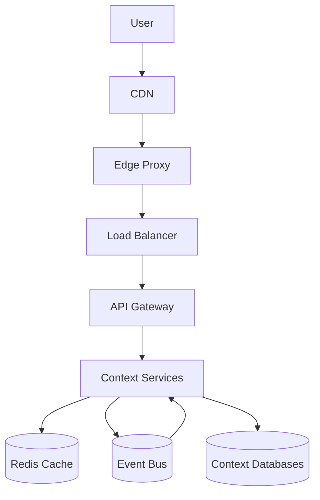

# Distributed System Design

## Scalability
- Horizontal stateless API scaling behind load balancers.
- Context-level service split for independent scale profiles.
- Async processing for expensive analytics and reminder fan-out.

## Load Balancing
- Layer 7 load balancing with health checks and weighted routing.
- Progressive rollout using canary and blue-green techniques.

## Latency, Throughput, and Caching
- Edge caching for static frontend assets.
- API cache-aside for read-heavy profile and catalog endpoints.
- Queue-backed async workflows to smooth burst traffic.
- Performance budgets by endpoint and context.

## Protocols, CDNs, Proxies, and WebSockets
- HTTP/2 and HTTP/3 at edge when available.
- CDN for static assets and regional acceleration.
- Reverse proxies for TLS termination and routing.
- WebSockets for real-time notification inbox updates where required.

## Event-Driven Architecture
- Domain events from context owners.
- Outbox pattern for reliable publication.
- Consumer retry, dead-letter, and idempotent handlers.

## Performance and Security Measures
- SLO-driven latency and error-rate monitoring.
- Request rate limits and abuse protection.
- API schema validation and contract enforcement.
- Security observability: auth failure rates, suspicious activity, anomaly alerts.

## Cost and Performance Optimization
- Autoscaling using queue depth and request metrics.
- Tiered storage retention for hot, warm, and cold data.
- Cost-per-request and cost-per-insight dashboards.

## Distributed Reference Topology

