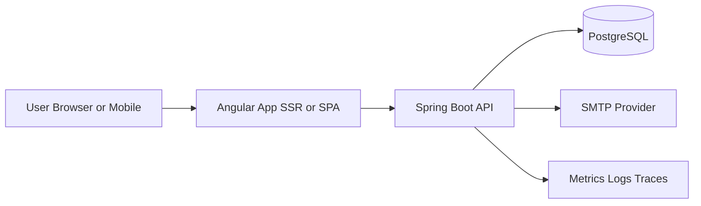

# High-Level Design

## Purpose
Examen provides a secure reflective-practice platform where users complete daily sessions, capture personal signals, and receive analytics and guidance.

## Product Capabilities
- Identity and access: register, login, password reset, token-based auth.
- Reflective workflow: start session, answer prompts, submit, and review history.
- Personal data tools: todos, journal, gratitude, habits.
- Insight services: profile trends, session summaries, AI-assisted prompts.
- Platform operations: reminders, notifications, observability, backups.

## High-Level Context

## Bounded Contexts
- Identity and Access
- Reflection Session
- Question and Category Catalog
- Growth and Wellbeing
- Profile Analytics
- Notifications and Reminders
- Personal Productivity (Todo and Journal)
- Insights and Recommendation

## Quality Attributes
- Security: least privilege, JWT validation, strict input validation.
- Reliability: retries for external calls, idempotent write endpoints where needed.
- Maintainability: clear module boundaries, DTO-based contracts, test pyramid.
- Scalability: horizontal API instances, context-level data ownership, cache-first reads for hot paths.

## Enterprise Direction
- Move from modular monolith to service-oriented architecture by bounded context.
- Introduce event contracts between contexts for independent scaling.
- Introduce policy-driven API gateway and centralized observability.
