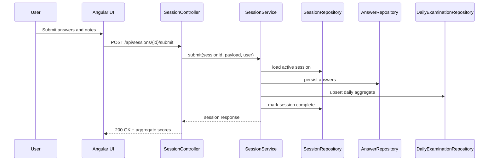

# Low-Level Design

## Backend Internal Layers
- Controller: request parsing, auth context, response mapping.
- Service: business rules, transactional boundaries, orchestration.
- Repository: persistence and query contracts.
- Model and DTO: internal state and external API contracts.

## Frontend Internal Layers
- Feature components: user flows and form state.
- Services: HTTP contracts and transformation logic.
- Guards and interceptors: auth and cross-cutting request behavior.

## Critical Flow: Session Submission

## Error and Validation Design
- Validation first: malformed input rejected with typed API errors.
- Domain guards: ownership, cooldown, and active-session checks enforced in services.
- Security guards: endpoint-level authorization and token validation.

## Extension Points
- `InsightsClient` strategy supports replacing stub inference with model-backed inference.
- Reminder channels can expand from email and in-app to push and SMS through provider interfaces.
