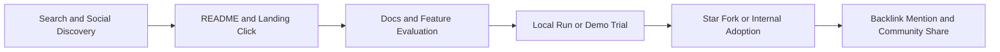

# SEO Growth Plan (Google and GitHub)

## Goal
Increase qualified discovery for Examen on both web search and GitHub search.

## Technical SEO (Google)
- Use a real production domain and set `APP_PUBLIC_URL` during build.
- Keep canonical URL consistent across all indexable pages.
- Keep `robots.txt` and `sitemap.xml` generated on every build.
- Keep SSR enabled to maximize crawlable HTML content.
- Keep fast Core Web Vitals by controlling bundle size and image weight.

## Indexing and Search Console
- Verify domain in Google Search Console.
- Submit `https://yourdomain.com/sitemap.xml`.
- Monitor index coverage, crawl errors, and page experience.
- Fix duplicate title and duplicate canonical findings quickly.

## Content and Keyword Strategy
- Build content clusters around:
  - reflective journaling
  - examination of conscience
  - spiritual habit tracking
  - AI reflection insights
  - secure fullstack architecture
- Publish weekly content with problem-solution format and concrete examples.
- Link each new article back to the relevant product capability page.

## Backlink Strategy
- Publish technical posts on architecture and API security learnings.
- Share tutorials and release notes in developer communities.
- Contribute guest posts and cross-link with related OSS projects.
- Prioritize backlinks from relevant domains over volume.

## GitHub Search Optimization
- Maintain clear repository description and topic tags.
- Keep README keyword-rich, practical, and frequently updated.
- Maintain security policy, issue templates, and contribution clarity.
- Keep release notes and changelog updated for active-maintenance signals.

## Funnel Model

## KPIs
- Organic impressions and click-through rate.
- Keyword ranking distribution (top 3, top 10, top 50).
- Branded vs non-branded traffic ratio.
- Conversion from visit to signup/demo/star.
- Backlink quality score and referring domains.

## 30-60-90 Day Plan
- 30 days: technical SEO baseline, metadata consistency, Search Console setup.
- 60 days: publish 6 to 8 high-intent content pages and 2 comparison guides.
- 90 days: backlink campaigns, partner mentions, and SERP performance iteration.
