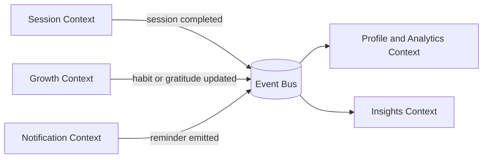

# System Design

## Core User Journeys
- Register and authenticate.
- Start and complete a daily session.
- Track progress and wellbeing signals.
- Manage questions, categories, todos, and journal entries.
- Receive reminders and notifications.
- Consume AI-assisted insights.

## Domain Model by Context
- Identity: user, credential, reset token.
- Session: examination session, answer, daily aggregate.
- Catalog: question, category, response type.
- Productivity: todo item, journal entry.
- Growth: gratitude entry, habit score, weekly summary.
- Notification: reminder policy, user notification state.
- Insight: summary, suggested questions, session guidance.

## Data and Interaction Model

## Key Design Decisions
- Strong write ownership by context.
- Event publication for cross-context read models.
- API gateway policy enforcement for security and consistency.
- Explicit idempotency for retriable operations.

## Non-Functional Targets
- P95 API latency under 250 ms for primary read endpoints.
- Availability target 99.9 percent for core reflective workflow.
- Zero known critical vulnerabilities in production.
- Recovery time objective under 30 minutes for critical outages.
