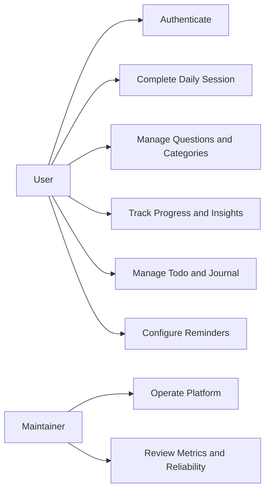
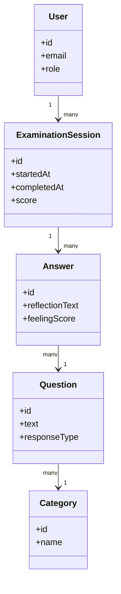
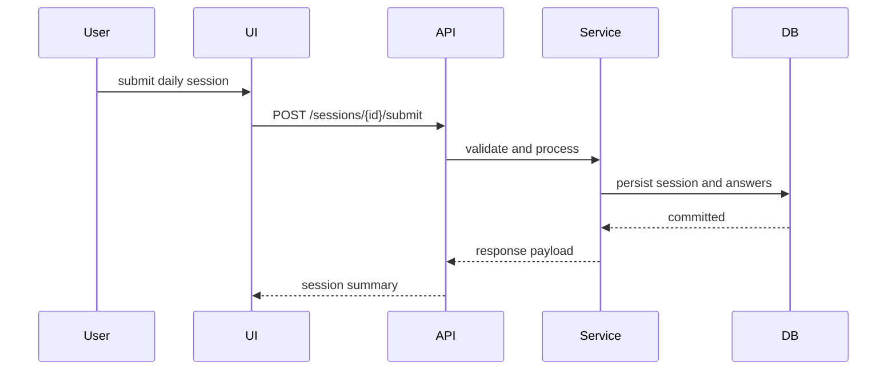

# UML

## Use Case View

```mermaid
flowchart LR
  User[User]
  Admin[Maintainer]

  User --> UC1[Authenticate]
  User --> UC2[Complete Daily Session]
  User --> UC3[Manage Questions and Categories]
  User --> UC4[Track Progress and Insights]
  User --> UC5[Manage Todo and Journal]
  User --> UC6[Configure Reminders]

  Admin --> UC7[Operate Platform]
  Admin --> UC8[Review Metrics and Reliability]
```

## Class View (Conceptual)

```mermaid
classDiagram
  class User {
    +id
    +email
    +role
  }
  class ExaminationSession {
    +id
    +startedAt
    +completedAt
    +score
  }
  class Answer {
    +id
    +reflectionText
    +feelingScore
  }
  class Question {
    +id
    +text
    +responseType
  }
  class Category {
    +id
    +name
  }

  User "1" --> "many" ExaminationSession
  ExaminationSession "1" --> "many" Answer
  Answer "many" --> "1" Question
  Question "many" --> "1" Category
```

## Sequence View (Session Completion)

```mermaid
sequenceDiagram
  participant User
  participant UI
  participant API
  participant Service
  participant DB

  User->>UI: submit daily session
  UI->>API: POST /sessions/{id}/submit
  API->>Service: validate and process
  Service->>DB: persist session and answers
  DB-->>Service: committed
  Service-->>API: response payload
  API-->>UI: session summary
```
